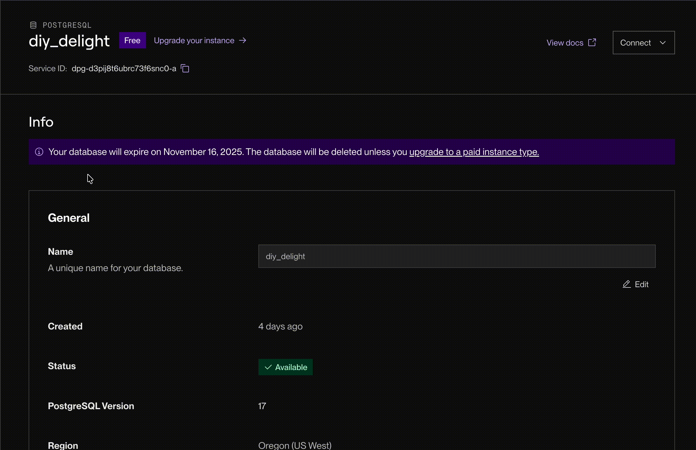

# WEB103 Project 4 - *DIY Delight*

Submitted by: **Khanh Tra Nguyen Tran**

Serena's Auréline is a creative web app that lets users design their own unique jewelry sets with jewelry pieces (bracelet, necklace, ring, and earrings). Users can choose materials, colors, charms, stones, and personalized engravings to create one-of-a-kind designs that match their style. The app allows users to create, view, edit, and delete their custom jewelry designs, offering a smooth, interactive experience with real-time previews. Whether you prefer elegant gold, playful charms, or minimalist silver, the Serena's Auréline helps you bring your perfect piece of jewelry to life — designed entirely by you.

Time spent: **10** hours

## Required Features

The following **required** functionality is completed:

<!-- Make sure to check off completed functionality below -->
- [X] **The web app uses React to display data from the API.**
- [X] **The web app is connected to a PostgreSQL database, with an appropriately structured `CustomItem` table.**
  - [X]  **NOTE: Your walkthrough added to the README must include a view of your Render dashboard demonstrating that your Postgres database is available**
  
  - [X]  **NOTE: Your walkthrough added to the README must include a demonstration of your table contents. Use the psql command 'SELECT * FROM tablename;' to display your table contents.**
  
- [X] **Users can view **multiple** features of the `Jewelry Set` they can customize, (bracelet, necklace, ring, and earrings)**
- [X] **Each customizable feature has multiple options to choose from**
- [X] **On selecting each option, the displayed visual icon for the `JewelrySet` updates to match the option the user chose.**
- [X] **The price of the `JewelrySet` (e.g. car) changes dynamically as different options are selected *OR* The app displays the total price of all features.**
- [X] **The visual interface changes in response to at least one customizable feature.**
- [X] **The user can submit their choices to save the item to the list of created `JewelrySet`s.**
- [X] **If a user submits a feature combo that is impossible, they should receive an appropriate error message and the item should not be saved to the database.**
- [X] **Users can view a list of all submitted `JewelrySet`s.**
- [X] **Users can edit a submitted `JewelrySet` from the list view of submitted `JewelrySet`s.**
- [X] **Users can delete a submitted `JewelrySet` from the list view of submitted `JewelrySet`s.**
- [X] **Users can update or delete `JewelrySet`s that have been created from the detail page.**

The following **optional** features are implemented:

- [X] Selecting particular options prevents incompatible options from being selected even before form submission (for each piece of jewelry - bracelet, ring, necklace, earrings - user can just add 1 to the jewelry set)

The following **additional** features are implemented:

- [ ] List anything else that you added to improve the site's functionality!

## Video Walkthrough

Here's a walkthrough of implemented required features:

<!-- Replace this with whatever GIF tool you used! -->
GIF created with [Kap](https://getkap.co/)
<!-- Recommended tools:
[Kap](https://getkap.co/) for macOS
[ScreenToGif](https://www.screentogif.com/) for Windows
[peek](https://github.com/phw/peek) for Linux. -->

## Notes

I, again, was struggling with the React front end code. I tried my best to enhance my frontend but it still looks really simple.

## License

Copyright [2025] [Khanh Tra Nguyen Trand]

Licensed under the Apache License, Version 2.0 (the "License"); you may not use this file except in compliance with the License. You may obtain a copy of the License at

> http://www.apache.org/licenses/LICENSE-2.0

Unless required by applicable law or agreed to in writing, software distributed under the License is distributed on an "AS IS" BASIS, WITHOUT WARRANTIES OR CONDITIONS OF ANY KIND, either express or implied. See the License for the specific language governing permissions and limitations under the License.